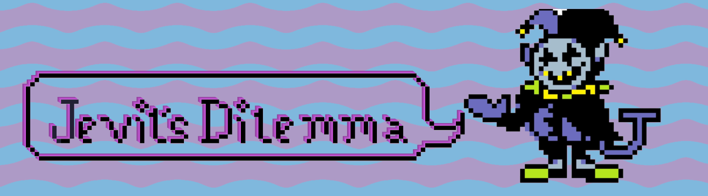

> 📌 The character in the title is called Jevil who is taken from a fanmade Undertale sequel called Deltarune.

> 📌 Join the Discord Server: 🟣 https://discord.gg/ec7XU7nD 🟣

> 📌 Here is The 🟣 [Figma Link](https://www.figma.com/file/SH41uZRXfEhQfxOGUbACUS/Untitled?type=design&node-id=0%3A1&mode=design&t=EAoU2P1Cn54kKSOB-1) 🟣

- [1.1. Description](#11-description)
- [1.2. Technologies](#12-technologies)
- [1.3. Usage](#13-usage)
  - [1.3.1. TailwindCSS](#131-tailwindcss)
- [1.4. Installation](#14-installation)
- [1.5. Contribution Guidelines\*](#15-contribution-guidelines)
  - [1.5.1. DOs](#151-dos)
  - [1.5.2. DONTs](#152-donts)
  - [1.5.3. Allowed Comments](#153-allowed-comments)
- [1.6. Game Flow For A Single Player](#16-game-flow-for-a-single-player)
- [1.7. Game Flow For Multiple Players](#17-game-flow-for-multiple-players)
- [1.8. Future Plans](#18-future-plans)

## 1.1. Description

This is a Web-based version of the tabletop party game called Dilemma. In the traditional version of this game you have a pack of flash cards, all of which contain a question. This question describes a scenario which forces you to choose an "action". There are no scores, no correct answers, no winners ... just pure brimming creativity. 

This game can be played [solo](#16-game-flow-for-a-single-player) or with [multiple](#17-game-flow-for-multiple-players) people.

> 📌 If you have questions regarding this game, you can ping me on Discord (username: blankscreen.exe)

## 1.2. Technologies

- [Tailwindcss](https://tailwindcss.com/)
- [Vite.js](https://vitejs.dev/)
- [React Router v6](https://reactrouter.com/en/main)
- [Redux Toolkit](https://redux-toolkit.js.org/) -- not used for now

## 1.3. Usage

> 📌 **Note:** This section will get updated along time

### 1.3.1. TailwindCSS

To have your tailwind classes take effect on styling, in other words, to compile tailwind classes, use the following command:

```sh
npm run tailwindCompile
```

## 1.4. Installation

> 📌 **Note:** This will get update along time

After cloning, you can install all the dependencies using

```sh
npm install
```

When you are done installing dependencies, you can serve your app with:

```sh
npm run dev
```

## 1.5. Contribution Guidelines*

### 1.5.1. DOs

1. Folder Structure for react componnets should be as follows:
```
...
src
|- componenets
  |- commons (contains all common components which can be reused over different sections of the game)
  |- home (only contains stuff related to home page)
    |- index.jsx
    |- subComponent1.jsx
    |- subComponent2.jsx
    |- ...
  |- gameInit (contains the "single-player" or "multi-player" choice components)
    |- index.jsx
    |- subComponent1.jsx
    |- subComponent2.jsx
    |- ...
  |- ...
...
```
2. Folders which are inside the `components` folder will be called **"secondary component folders"**
3. Only the `index.jsx` files will be exported out of any **"secondary component folders"**. Other files inside those folders will be imported by their own `index.jsx` files.
4. You will be following the [gitflow](https://www.youtube.com/watch?v=VK0KUolSCQg&list=PL_RrEj88onS98ELS0mWqav1qTIYaChf41) conventions.
5. You should [ESLint](https://www.youtube.com/watch?v=SMbqi1HPprc) to keep your code clean. Javascript code tends to get messy real fast. It is ok to use the default one. We will follow [AirBnB's style guide](https://github.com/airbnb/javascript).
7. Use [Git Commit Message Conventions](https://www.conventionalcommits.org/en/v1.0.0/) to write proper commit messages. You can use a [this](https://marketplace.visualstudio.com/items?itemName=vivaxy.vscode-conventional-commits) (EXTENSION ID: vivaxy.vscode-conventional-commits) VS Code extension for this purpose too.
8. Feel free to write some issues with this repository. All Critics are welcome.
9. Follow clear variable naming conventions.
10. Use `PropTypes` in each react component (as long as they are using any Props)
11. Use the `src/data/*.json` folder to store any dummy data.
12. Make use of TODOs, wherever you see it fit. A list of all allowed TODOs can be found [here](#153-allowed-comments).

### 1.5.2. DONTs

1. Do NOT leave any `console.log` statements in your commits.
2. Do NOT leave any *commented code* in your commits.
3. Do NOT do a blank pull request. No need to go all out with words. Just explain what you have done in a nutshell.
4. You should NOT directly commit to the `main` or `develop` branch. Just create your own branch inside a proper folder (e.g. `feat/*`, `fix/*` etc). After you are done, submit a pull request.
5. I'm hoping none of you would commit an entire `node_modules` folder, now would you?

### 1.5.3. Allowed Comments

|Comment Tag|Description| What You Should Write About| Example |
|---|---|---|---|
| `TODO:` | whenever there is something you need to do later on or let people know that some work is remaining. | write about what do we need to do in a block of code | **TODO**: we need to declare proptypes in this component |
| `REF:` | if you copy an intellectual piece of code from somewhere. | paste a link from where you copied the code e.g. stack overflow or some other sites | **REF**: used this for implementing dilemma history management <some stackoverflow link> |
| `REVIEW:` | use this if a piece of your code needs someone else's review. | describe what aspects or lines of code should be reviewed | **REVIEW**: should this component be included in the Home page? also review it for security vulnerabilities. |
| `WARN:` | use it to warn other developers about making any changes to a critical piece of code which can potentially cause bugs or cause the app to crash | describe the warning. What is it that should or should not be changed such that it does not break the app | **WARN**: This function might cause performance issues with large datasets since we are using double for loops |
| `BUG:` | use this to let others know you have discovered a bug somewhere. | describe the bug you found | **BUG**: clicking the "next dilemma" button does not show another question. This was working before I wrote some code in this component. |
| `FIXME:` | Same scenario as `BUG:` but here you have supposedly found out what was causing the problem and you are now suggesting a fixing strategy | suggest a way how to fix it | **FIXME**: z-index of this component seems to be more than 100. Make it less than 10. |

With all that said and done... have fun coding stuff. Hope you will have a great time 😁.

> 📌 * Pull requests which do not follow the **Contribution Guidelines** will not be merged.

## 1.6. Game Flow For A Single Player

1. The player enters the site, writes their name in the given text box (labled as "your name") and chooses "single player".
2. They are redirected to a new screen where the game is played.
3. In the screen(point 2) the player has a single button "Start" which starts the game
4. After clicking "start", they recieve a randomly selected dilemma question from a set of dilemmas (stored in a JSON file in `./src/data/dilemmas.json`)
5. They start typing their response to the dilemma question in the given text box below the question
6. When they hit enter or click on the "submit" button, they see a list named "history" get appended by the current question (including the player's response). Also as a reaction to clicking the "submit" button, the current question is replaced with another question.
7. Note that these questions cannot be repeated, so before we fetch the next question we will first filter out all the question that player have already seen. this can be done by assigning each question with unique IDs. These IDs will also be stored inside the JSON file.
8. The Player after receiving total of 10 questions will have the option to restart the game or export the results.
9. They should be able to export their question/response history in one of the selected format CSV,HTML,TXT,PDF(optional)
10. The data related to player's play-routine will not be stored in the database

## 1.7. Game Flow For Multiple Players

1. The player enters the site, writes their name in the given text box (labled as "your name") and chooses "multiplayer player".
2. They are redirected to a new screen where the game is played.
3. In a corner they have a CODE for the current game session. This CODE can be shared to invite another player(s) into the game.
4. As the new player clicks the link they are shown a page where they need to write their name (similar to point 1), but the option to choose "single player" or "multiplayer" are not given in this screen.
5. As the new player joins the session, a Toast is shown in the top-right corner of the screen with the name of the new user.
6. All the players will see a single button (start) on the screen. clicking it will display a randomly selected dilemma question.
7. Each player will write their responses in a given text box and click "submit".
8. A new dilemma question will not be shown until all of the players have submitted their response.
9. A public history for each players responses w.r.t questions will be appended with the current response.
10. All the players will go through this until they have submitted responses for total of 10 questions. After that they will have an option to export their results in one of the predefined formats CSV,HTML,TXT,PDF(optional)
11. The session will then end as soon as the limit of 10 questions is reached. Kicking all players out of the session.
12. The data related to player's play-routine will not be stored in the database

## 1.8. Future Plans

> These are far-fetched plans. Do not believe them. We may or may not implement all of the below:

- [ ] Make It available for a solo player to play this game.
- [ ] Make It available for a multiple players to play this game.
- [ ] Make it available for players to share links to playrooms to play with their friends (details can be found [here](docs/shareable_link_considerations.md))
- [ ] Make that sharable link able to be shared as a QR Code.
- [ ] Make it available for player to chat while in a game session.
- [ ] Make it available for people to export their data from a game session to multiple (not all, but some) formats CSV,HTML,TXT,PDF etc
