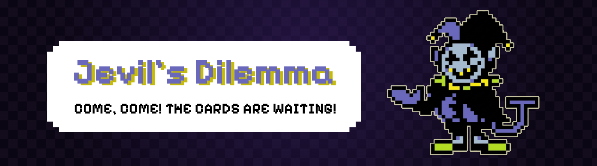

# Jevil's Dilemma

A pixel-art take on the _Dilemma_ party card game, hosted by Jevil from Deltarune.

Each card puts you in an awkward situation with two choices. There are no right answers, but
Jevil is keeping track: every pick nudges you across a **Lawful ↔ Chaotic** and **Good ↔ Evil**
alignment chart, and at the end he gives you his reading of who you really are. Save the result as an image.

> **Status:** in development. The project is being rebuilt from scratch.

## Features (v1)

- Solo play, 10 cards per run, no repeats
- Jevil reacts to every choice
- Optional "why?" note for each answer
- Hesitation meter: finds your hardest decision
- Results card with your place on a 3×3 alignment chart, exportable as an image
- Installable PWA that works fully offline
- No accounts and no server: your answers never leave your device

## Tech stack

|                   |                                               |
| ----------------- | --------------------------------------------- |
| UI                | React, TypeScript                             |
| Build             | Vite                                          |
| Styling           | Tailwind CSS v4 with a custom pixel-art theme |
| Offline / install | `vite-plugin-pwa` (Workbox)                   |
| Persistence       | `localStorage` (versioned, validated on load) |
| Testing           | Vitest, React Testing Library                 |
| Tooling           | Bun, oxlint, Prettier, GitHub Actions         |

The reasoning behind each choice is recorded in [docs/DECISIONS.md](docs/DECISIONS.md).
Game design and future ideas are in [docs/GAME_DESIGN.md](docs/GAME_DESIGN.md).
The image asset spec is in [docs/ASSETS.md](docs/ASSETS.md).

## Getting started

Requires [Bun](https://bun.sh).

```sh
bun install
bun run dev
```

| Script                  | What it does                       |
| ----------------------- | ---------------------------------- |
| `bun run dev`           | Start the dev server               |
| `bun run build`         | Typecheck and build for production |
| `bun run preview`       | Serve the production build locally |
| `bun run test`          | Run the test suite once            |
| `bun run test:watch`    | Run tests in watch mode            |
| `bun run test:coverage` | Run tests with a coverage report   |
| `bun run lint`          | Lint with oxlint                   |
| `bun run typecheck`     | Type-check without building        |
| `bun run format`        | Format all files with Prettier     |

> Use `bun run test`, not `bun test`: the latter starts Bun's own test runner instead of Vitest.

## Design

UI mockups: [Figma](https://www.figma.com/file/SH41uZRXfEhQfxOGUbACUS/Untitled?type=design&node-id=0%3A1&mode=design&t=EAoU2P1Cn54kKSOB-1)

## Contributing

- Branch from `develop` using `feat/*`, `fix/*` or `chore/*`.
- Open a pull request into `develop`; `develop` is merged into `main` for releases.
- Commit messages follow [Conventional Commits](https://www.conventionalcommits.org/).

## Disclaimer

This is a non-commercial fan project. Jevil and Deltarune are created by and belong to
Toby Fox. _Dilemma_ is a separate commercial card game; the cards in this project are
original wording. All artwork in this repository is original.
